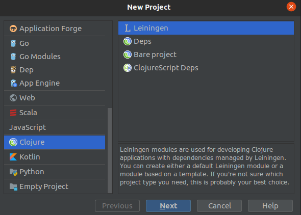
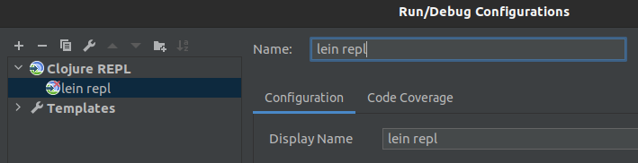

# Clojure

## Compiler

Follow instructions to download & install [Leiningen](https://leiningen.org/).

## Intellij plugin

- Install Cursive plugin & restart.

- Create a new Leiningen project.

No uppercase names are allowed so call it **clojure_course**.

- Go to `Run`  -> `Edit configurations...`
    - Add a new (+) run configuration: **Clojure REPL** -> **Local**
    
    

